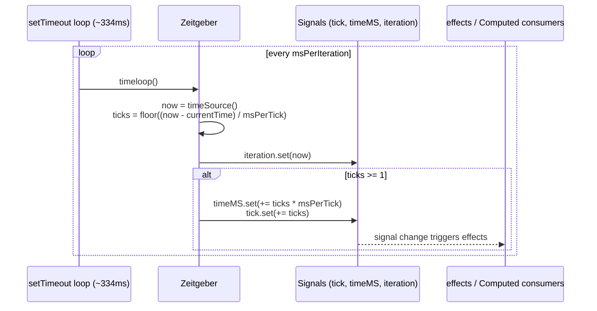
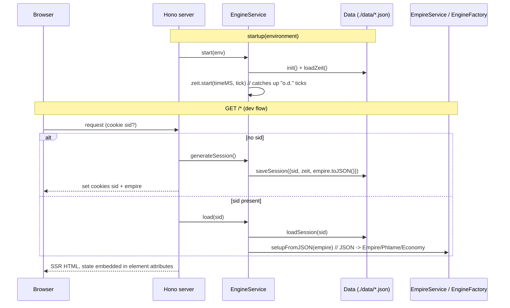
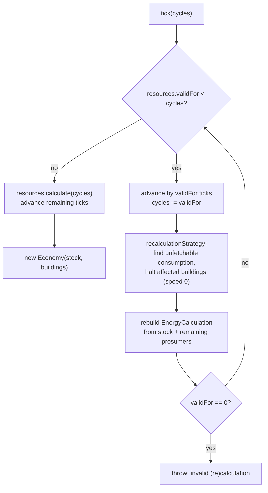

# Tick Flow — how time drives the economy

The one mechanism everything hangs on: a **Zeitgeber** advances a tick counter, and the
economy is only ever recalculated on demand by fast-forwarding from its last known tick
(["lazy realtime"](decisions/0002-lazy-realtime-economy.md)). GitHub and VS Code render
the Mermaid diagrams below inline.

## 1. The Zeitgeber (src/app/signals/zeitgeber.ts)

Runs on both server and client. Every `msPerIteration` (~334ms) it reads wall time and
derives how many whole ticks (`msPerTick`, default 10s) have passed; `tick`, `timeMS` and
`iteration` are Signals, so anything derived updates automatically. `hold(tick)` freezes
the loop for time-travel debugging (TickSlider / "Zeitleiste").

## 2. Server lifecycle (src/server.ts, src/engine.server.ts)

## 3. Client hydration & live updates

`main.ts` registers the custom elements; context elements pull state out of their
attributes and rebuild the same engine objects the server had:

- `empire-ctx` parses its `entities` attribute → `EmpireService.setupFromJSON`
- `ph-ctx` binds one planet → fresh `EconomyService.setup(id)` per element
- `ph-resources` subscribes to the Zeitgeber and drives the actual fast-forward
  (`resources.element.tsx`): `zeit.effect(() => { eco.current.update(tick); ... })`

## 4. Economy.tick(cycles) — the fast-forward core (engine/src/lib/Economy.ts)

`Phlame.update(tick)` computes `cycles = tick - lastTick` and delegates here. The loop
advances in segments: `validFor` says how many ticks the current rates stay truthful
(until some stock hits empty/full or an energy limit); at each boundary the
recalculation strategy halts buildings whose consumption can no longer be met, then
rates are rebuilt.

Energy deficit never halts the loop by itself: `EnergyCalculation` instead degrades all
production by `balanceFactor ** 1.1` (deficit multiplier) until the balance recovers —
shown in the UI as "Degraded to N%".

## Invariants worth keeping in mind

- Fast-forwarding N ticks in one call must equal N single-tick updates (integer rates,
  [ADR 0003](decisions/0003-int32-resource-arithmetic.md)).
- `Economy.tick` never mutates — every segment produces new value objects
  ([ADR 0005](decisions/0005-immutable-value-objects.md)); only `Phlame` swaps its economy.
- Client and server run identical engine code on identical JSON — divergence is a bug.
- Persisted snapshots only store `{ zeit, empire }`; everything else is derivable.
